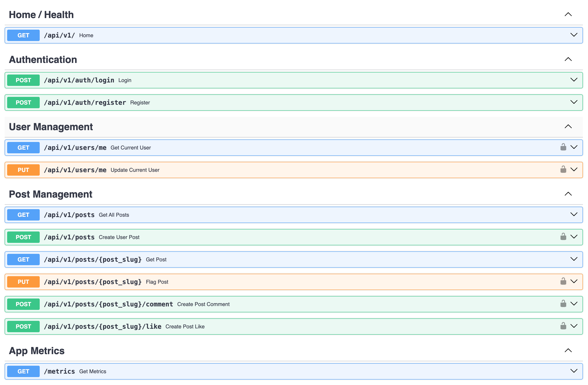
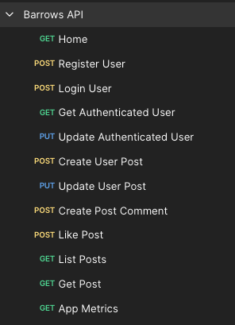
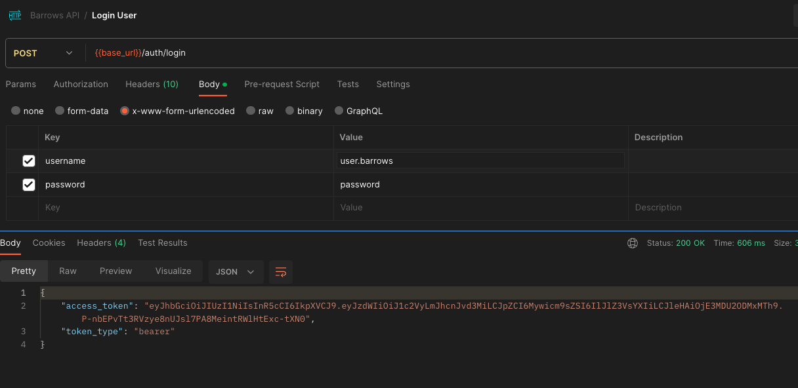
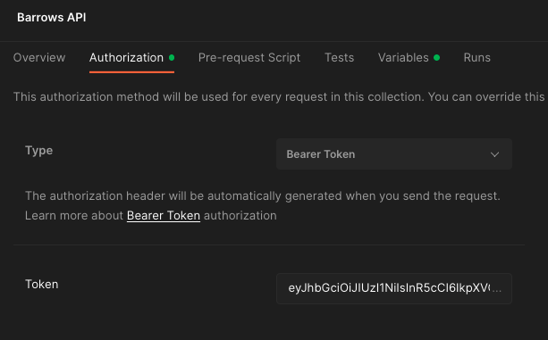

# Barrows Back-end Assessment

## Introduction
This repository covers the implementation for building a Web text forum with the following requirements:  
You are tasked with building the API and datastore backend of a web forum for a small number
of users (< 100). The forum is a basic text system which has the capabilities to add posts,
retrieve posts, and like posts. Management does not believe in users editing or deleting existing
posts, for ethical reasons.

## Solution
I will be building a REST API using [FastAPI](https://fastapi.tiangolo.com/) :zap:.  
FastAPI is a minimalistic microframework, renowned for its performance, excellent documentation, security features, and advanced features like strict typing thanks to Pydantic.  
One of my favorite features of FastAPI is its automatic documentation built on top of OpenAPI Specification.  
Every endpoint is automatically loaded into the app's documentation together with it's corresponding schema validation and response.  
\
Here is the full tech stack for this project:
- Python 3.11
- FastAPI
- Docker (containerization)
- PostgreSQL (datastore)
- Redis (caching layer)

Some notable package dependencies:
- SQLAlchemy 1.4 (ORM layer for database intereaction)
- Pydantic (Data validation)

### Requirements
You will only need Docker & GNU Make for this assessment   
```bash
$ docker --version
Docker version 24.0.6, build ed223bc
```
````bash
$ make --version
GNU Make 3.81
Copyright (C) 2006  Free Software Foundation, Inc.
This is free software; see the source for copying conditions.
There is NO warranty; not even for MERCHANTABILITY or FITNESS FOR A
PARTICULAR PURPOSE.

This program built for i386-apple-darwin11.3.0
````

### Instructions
There's a Makefile with appropriate target scripts for all the operations needed to run this project. You can run `make help` at any moment to get insight in what each Make command does and of course inspect each script accordingly.

1. Clone this repo and make sure you're on the `maaster` branch
2. Run `make start`. This will start a Docker network with the necessary component for the app to run
3. Once the network is up and running, we can migrate our schema and seed some data by running `make seed`
4. You may follow server logs accross the docker network by running `make logs`  

You're all set !

Let's check that the app is healthy and all supporting services are up and running:  
```bash
$ docker container ls -a --format "table {{.Names}}\t{{.Image}}\t{{.Ports}}\t{{.Status}}"
```
You should get a response similar to this:
```bash
NAMES            IMAGE                    PORTS                    STATUS
barrows-app      barrows-app              0.0.0.0:8000->8000/tcp   Up About a minute
barrows-db       postgres:14-alpine       0.0.0.0:5432->5432/tcp   Up About a minute (healthy)
barrows-redis    redis:7.2.1-alpine3.18   0.0.0.0:6379->6379/tcp   Up About a minute (healthy)
```
 \
`barrows-app`: FastAPI app served via uvicorn on port 8000  
`barrows-db`: Standard PostgreSQL instance served and exposed on standard port 5432  
`barrows-redis`: Redis Server used instance for caching  

### API Documentation
FastAPI natively supports OpenAPI specification out of the box.  
Swagger UI Docs are available on `http://localhost:8000/api/docs` 
\
\


### Endpoints
The api is served on `localhost:8000/api/v1`  
A postman collection is also available in the postman folder (`barrows-api-collection.json`)  
Once you import the collection you should have something like this:  
\

> You may also you the Swagger UI Docs to carry out your tests. Postman is entirely optional
### API  authentication
Our REST API supports JWT based authentication. This means every login request will produce a token which will then be embedded in the Header in every subsequent authenticated request as a Bearer token:  
1. Visit the "Login User" endpoint (`POST http://localhost:8000/api/v1/auth/login`)
2. In postman, there are some default credentials included in the collection already. Full CURL request:
```bash
curl -X 'POST' \
  'http://localhost:8000/api/v1/auth/login' \
  -H 'accept: application/json' \
  -H 'Content-Type: application/x-www-form-urlencoded' \
  -d 'grant_type=&username=user.barrows&password=password'
```
3. The output should be something like this:
  

4. Copy the `access_token`. Back to collection page, include the Bearer token in the Authorization section

5. You should be good to go now ! All protected routes will inherit the Bearer token
6. There's a Moderator level user seeded with username / password as `admin/admin`. You may use this user to confirm elevated privileges actions like marking a post as misleading.

### Testsuite
WIP

## Conclusion
That's the end of my assessment. Thank you very much for your patience and giving me enough time to do this.  
I appreciate the consideration  
\
Steve Kamanke  
https://www.stevekamanke.com
