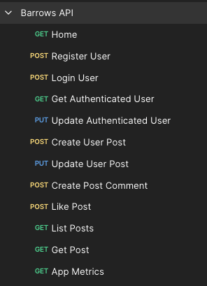
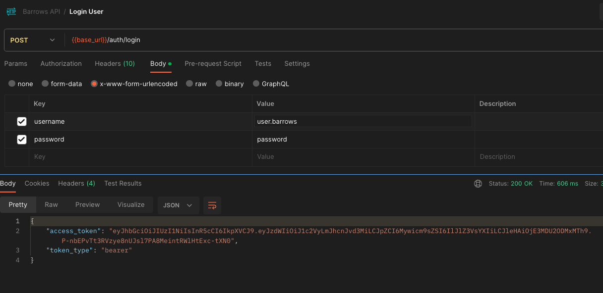
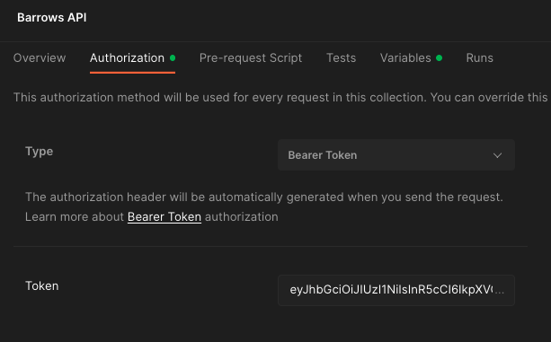

## Introduction
This repository covers the implementation for building a Web text forum with the following requirements:  
You are tasked with building the API and datastore backend of a web forum for a small number
of users (< 100). The forum is a basic text system which has the capabilities to add posts,
retrieve posts, and like posts. Management does not believe in users editing or deleting existing
posts, for ethical reasons.

## Solution
I will be building a REST API using [FastAPI](https://fastapi.tiangolo.com/) :zap:.  
FastAPI is a minimalistic microframework, renowned for its performance, excellent documentation, security features, and advanced features like strict typing thanks to Pydantic.  
One of my favorite features of FastAPI is its automatic documentation built on top of OpenAPI Specification.  
Every endpoint is automatically loaded into the app's documentation together with it's corresponding schema validation and response.  
\
Here is the full tech stack for this project:
- Python 3.11
- FastAPI
- Docker (containerization)
- PostgreSQL (datastore)
- Redis (caching layer)

Some notable package dependencies:
- SQLAlchemy 1.4 (ORM layer for database interaction)
- Pydantic (Data validation)

### Requirements
You will only need Docker & GNU Make for this assessment   
```bash
$ docker --version
Docker version 24.0.6, build ed223bc
```
````bash
$ make --version
GNU Make 3.81
Copyright (C) 2006  Free Software Foundation, Inc.
This is free software; see the source for copying conditions.
There is NO warranty; not even for MERCHANTABILITY or FITNESS FOR A
PARTICULAR PURPOSE.

This program built for i386-apple-darwin11.3.0
````

### Instructions
There's a Makefile with appropriate target scripts for all the operations needed to run this project. You can run `make help` at any moment to get insight in what each Make command does and of course inspect each script accordingly.

1. Clone this repo and make sure you're on the `master` branch
2. Run `make start`. This will start a Docker network with the necessary component for the app to run
3. Once the network is up and running, we can migrate our schema and seed some data by running `make migrate`
4. You may follow server logs across the docker network by running `make logs`  

You're all set !

Let's check that the app is healthy and all supporting services are up and running:  
```bash
$ docker container ls -a --format "table {{.Names}}\t{{.Image}}\t{{.Ports}}\t{{.Status}}"
```
You should get a response similar to this:
```bash
NAMES            IMAGE                    PORTS                    STATUS
forum-api      forum-api                0.0.0.0:8000->8000/tcp   Up About a minute
forum-db       postgres:14-alpine       0.0.0.0:5432->5432/tcp   Up About a minute (healthy)
forum-redis    redis:7.2.1-alpine3.18   0.0.0.0:6379->6379/tcp   Up About a minute (healthy)
```
 \
`forum-api`: FastAPI app served via uvicorn on port 8000  
`forum-db`: Standard PostgreSQL instance served and exposed on standard port 5432  
`forum-redis`: Redis Server used instance for caching  

### API Documentation
FastAPI natively supports OpenAPI specification out of the box.  
Swagger UI Docs are available on `http://localhost:8000/api/docs` 
\
\


### Endpoints
The api is served on `localhost:8000/api/v1`  
A postman collection is also available in the postman folder (`forum-api-collection.json`)  
Once you import the collection you should have something like this:  
\

> You may also you the Swagger UI Docs to carry out your tests. Postman is entirely optional
### API  authentication
Our REST API supports JWT based authentication. This means every login request will produce a token which will then be embedded in the Header in every subsequent authenticated request as a Bearer token:  
1. Visit the "Login User" endpoint (`POST http://localhost:8000/api/v1/auth/login`)
2. In postman, there are some default credentials included in the collection already. Full CURL request:
```bash
curl -X 'POST' \
  'http://localhost:8000/api/v1/auth/login' \
  -H 'accept: application/json' \
  -H 'Content-Type: application/x-www-form-urlencoded' \
  -d 'grant_type=&username=test.user&password=password'
```
3. The output should be something like this:
  

4. Copy the `access_token`. Back to collection page, include the Bearer token in the Authorization section

5. You should be good to go now ! All protected routes will inherit the Bearer token
6. There's a Moderator level user seeded with username / password as `admin/admin`. You may use this user to confirm elevated privileges actions like marking a post as misleading.

### Caching
FastAPI's uvicorn server is already quite fast. However, we want to ideally reduce the load on our database for every GET request that can be cached as opposed to always hitting the database directly.  
We use Redis for our caching server. Every GET requests on posts are cached and subsequent requests will hit the Redis instead. This is already embedded in Swagger UI.  
For Postman, include the `Cache-Control: max-age` header in the `GET posts` or `GET posts/{post_slug}`. You can also observe the logs to make sure there's no database interaction during this process

### Testsuite
You can run tests using the Make command `make test`. It is powered by PyTest and runs using a SQLite Database as opposed to the main PostgreSQL database.
```bash
./scripts/test.sh

> Running Test suite

=============================================================================================== test session starts ================================================================================================
platform linux -- Python 3.11.7, pytest-7.4.3, pluggy-1.3.0
rootdir: /src
plugins: time-machine-2.13.0, anyio-3.7.1
collected 6 items

tests/test_auth.py ..                                                                                                                                                                                        [ 33%]
tests/test_home.py .                                                                                                                                                                                         [ 50%]
tests/test_posts.py .                                                                                                                                                                                        [ 66%]
tests/test_users.py ..                                                                                                                                                                                       [100%]

========================================================================================== 6 passed, 5 warnings in 4.70s ===========================================================================================

> Completed !
```

### Clean up
Make sure to run `make clean` after you're done testing. This will delete any environment variables, datastore's, as well as destroy all docker resources (images, volumes, containers, etc) provisioned for this assessment.  


### API Security tips
We can mitigate abuse on our API by implementing some common safeguards:
- <ins>Rate Limiting:</ins>  
We can restrict the number of requests a client can make to our API within a specific time frame. This will be our first line of defense against DDoS attacks, bot spamming, and Data scrapping.  
One way of implementing this in FastAPI by defining a custom decorator that will set the maximum number of requests allowed, compute the time interval in which said requests occurred, and compare with a time frame we define as limit.
Non-compliant requests will result in a `429 Too Many Requests`. We should also log all incoming requests and responses (some of which I have already done through a logging middleware). This will help us carry out security audits and identify potential vulnerabilities.
- <ins>Enforce HTTPS</ins>   
Depending on whether our API will be public facing (e.g. Headless CMS) we could add a security layer when deploying to production by having uvicorn enforce an TLS/SSL certificate which would enable HTTPS.  
- <ins>API Gateway</ins>  
A common design pattern for REST APIs is to abstract the APIs themselves from the client and introduce a middleman proxy called an API Gateway. Most of the already discussed security measures will be addressed in this layer given that it will be public facing. e.g. Load balancing, API monitoring, IP whitelisting, Caching, protocol translation and service discovery. It will be the sole consumer of our API given that our API will now be private facing. An API Gateway therefore acts as a single point of entry for our API. Another similar pattern to this is the Backend-for-frontend pattern. The difference here however, is that instead of a single point of entry, backend-for-frontend, as the name suggest, is tightly coupled to the presentation layer. Which means a web app will one its own bff, and a mobile app will have its own bff.


## Conclusion
We have now build a minimalistic API for a web forum.  
There is obviously much more to be done here, but that should be a good starting point.

\
Steve Kamanke  
https://www.stevekamanke.com
