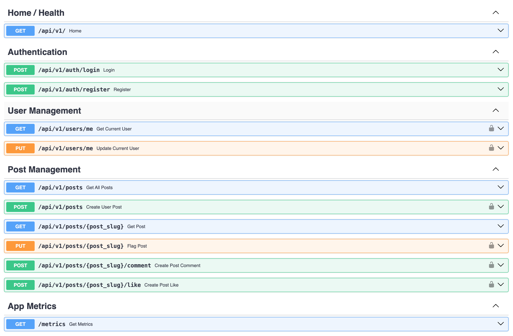

# Barrows Back-end Assessment

## Introduction
This repository covers the implementation for building a Web text forum with the following requirements:  
You are tasked with building the API and datastore backend of a web forum for a small number
of users (< 100). The forum is a basic text system which has the capabilities to add posts,
retrieve posts, and like posts. Management does not believe in users editing or deleting existing
posts, for ethical reasons.

## Solution
I will be building a REST API using [FastAPI](https://fastapi.tiangolo.com/) :zap:.  
FastAPI is a minimalistic microframework, renowned for its performance, excellent documentation, security features, and advanced features like strict typing thanks to Pydantic.  
One of my favorite features of FastAPI is its automatic documentation built on top of OpenAPI Specification.  
Every endpoint is automatically loaded into the app's documentation together with it's corresponding schema validation and response.  
\
Here is the full tech stack for this project:
- Python 3.11
- FastAPI
- Docker (containerization)
- PostgreSQL (datastore)
- Redis (caching layer)

Some notable package dependencies:
- SQLAlchemy 1.4 (ORM layer for database intereaction)
- Pydantic (Data validation)

### Requirements
You will only need Docker & GNU Make for this assessment   
```bash
$ docker --version
Docker version 24.0.6, build ed223bc
```
````bash
$ make --version
GNU Make 3.81
Copyright (C) 2006  Free Software Foundation, Inc.
This is free software; see the source for copying conditions.
There is NO warranty; not even for MERCHANTABILITY or FITNESS FOR A
PARTICULAR PURPOSE.

This program built for i386-apple-darwin11.3.0
````

### Instructions
Run `make start`. It runs docker-compose with 3 services (app, db, cache).  
This will build the app's Dockerfile, pull images for our other dependencies and start a Docker network with the necessary component for the app to run.  

You're all set !

Let's check that the app is healthy and all supporting services are up and running:  
```bash
$ docker container ls -a --format "table {{.Names}}\t{{.Image}}\t{{.Ports}}\t{{.Status}}"
```
You should get a response similar to this:
```bash
NAMES            IMAGE                    PORTS                    STATUS
barrows-app      barrows-app              0.0.0.0:8000->8000/tcp   Up About a minute
barrows-db       postgres:14-alpine       0.0.0.0:5432->5432/tcp   Up About a minute (healthy)
barrows-redis    redis:7.2.1-alpine3.18   0.0.0.0:6379->6379/tcp   Up About a minute (healthy)
```
We can seed some dummy data by running `make seed`.

### Endpoints
All endpoints can be visualised, together with their validation requirements in the Swagger Docs on `http://localhost/api/v1`.  
\

\
\
A postman collection is also available at root level (`barrows-api-collection.json`)
\
### Testsuite
WIP